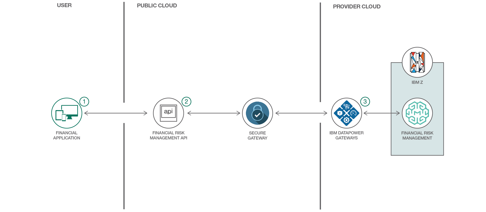
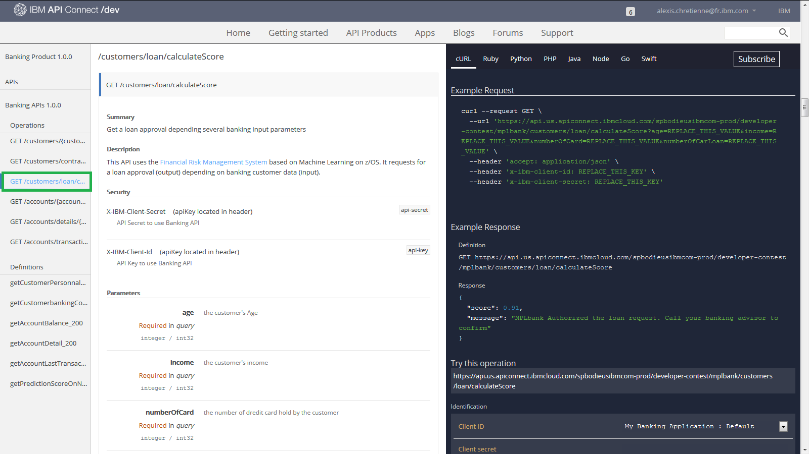
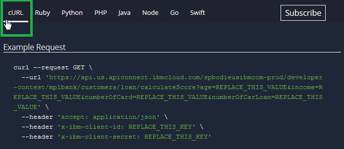
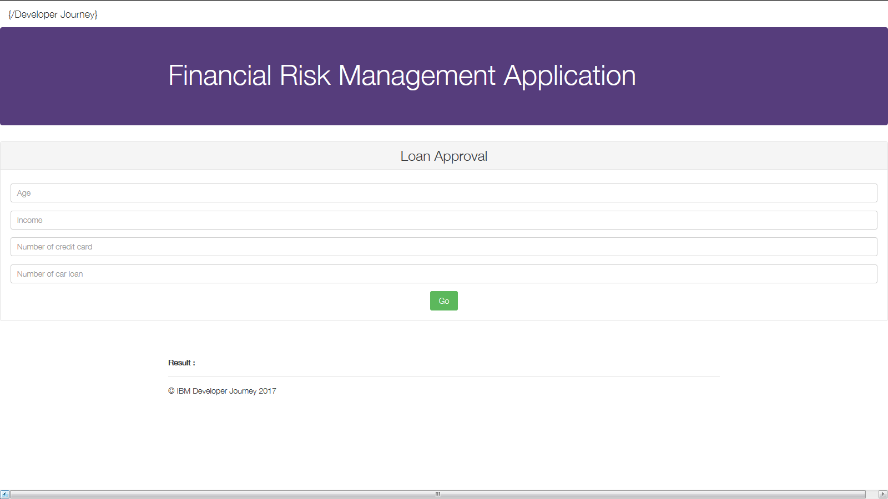
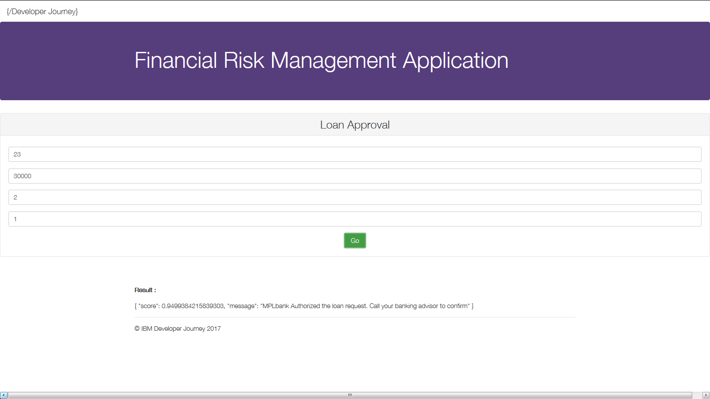
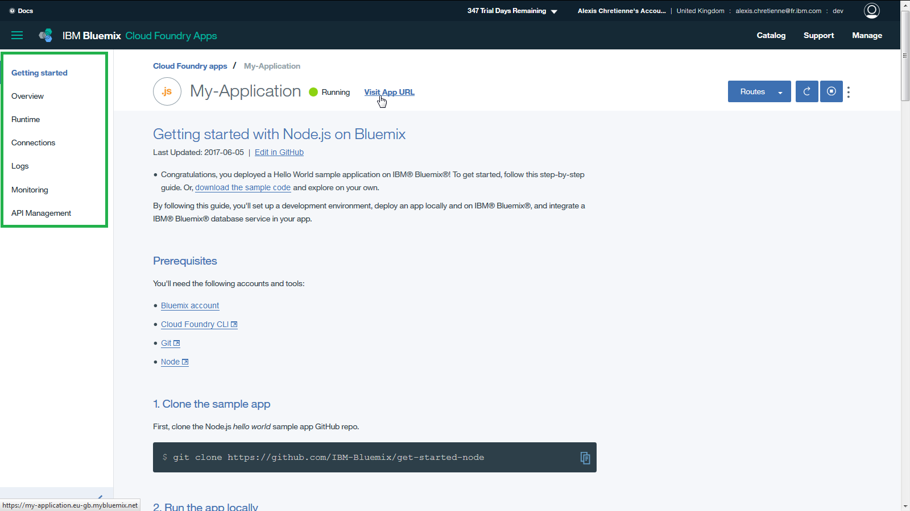
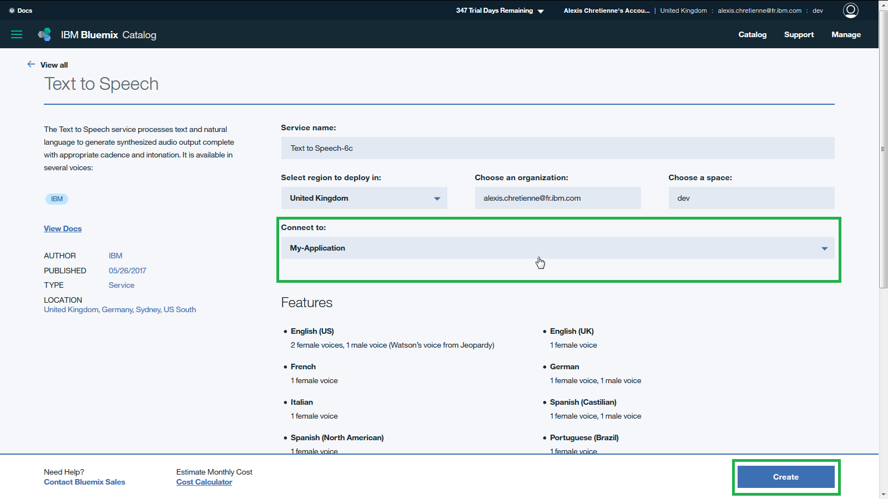
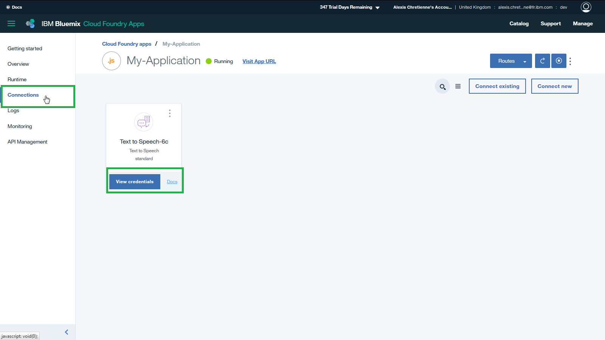

# Financial Risk Management using Machine Learning on z/OS

The following documentation will introduce the available Financial Risk Management API published on IBM Bluemix with Machine Learning on z/OS running on the IBM z Systems Mainframe through a simulated retail bank called MPLbank.

# MPLbank

## Architecture

This journey accesses a fictitious retail banking system called MPLbank. Similar to real retail bank systems, MPLbank contains a Financial Risk Management System based on [Machine Learning for z/OS]. The initial predictive model was designed to deliver a score representing the probability of the capacity of loan refund for a banking customer according to his personal data. On top of these components, an API layer hosted in IBM Bluemix has been set up to deliver an API, illustrating an online decision for loans approval.

Following the next schema, the predictive model was build from data using IBM Machine learning tools. Banking customer data was selected (his age, his number of credit card, his income  and his number of car loans) to predict a score (probability for capacity of loan refunding) and an action (next customer's behaviour). Then it was trained with 80% of historical data and was evaluated with 20% of historical data. In this way, It ensures that the model is able to learn from fresh data.

Once the model has been approved, it has been deployed in order to act as a scoring service. On top of this service, an API was created and published to an API developer Portal. In other words, this scoring service is callable trough API. 

Objectives in this journey are to discover, test and use this Financial Risk Management API using a sample financial application, then to enhance it.

## Included Components

The journey is accomplished by using an Hybrid [IBM Bluemix] / [IBM Z Mainframe] architecture:

* [Db2 for z/OS]
* [Machine Learning for z/OS]
* [API Connect]
* [Secure Gateway Service]
* [DataPower Gateway]

# Steps

### Part A: Discover and test the Financial Risk Management API

1.	[Start with IBM Developer API Portal](#1-start-with-ibm-developer-api-portal)
2.	[Subscribe to the Financial Risk Management API](#2-subscribe-to-the-financial-risk-management-api)
3.	[Work with the Financial Risk Management API](#3-work-with-the-financial-risk-management-api)

### Part B: Make you own Financial Risk Management application

1.	[Download and review the Financial application code](#1-download-and-review-the-financial-application-code)
2.	[Run the Financial application](#2-run-the-financial-application)

### Part C: Extend the Financial Risk Management application

1. 	[Start with Node.js on Bluemix](#1-start-with-node-js-on-bluemix)
2.	[Make a Cognitive application using Watson Services](#2-make-a-cognitive-application-using-watson-services)

---

# Part A: Discover and test the Financial Risk Management API

## 1. Start with IBM Developer API Portal 
1.	Sign up for an [IBM ID] if you don't have one already.

2.	Go to [IBM Developer Portal].

3. Create an account if you have not done do already.
	
   * Click **Create an Account**.
   * Provide all required information. Be sure to use your IBM ID (email) for this account.
   * Click **Submit**.

  
   An account activation email will be sent to your registred IBM ID email. Click on the link in this email to activate your account before.

4. Login to your account.

5. Create a new application (work space for this project).
	
	* Click **Apps** from the menu.
	* Click **Create new App**.
	* Fill in all required fields.
	* Click **Submit**.
	
	Make a note of the *client ID* and *client Secret*. You will need them to access the API later.
	

## 2. Subscribe to the Financial Risk Management API 

1.	Before working with banking APIs, you need to subscribe first. Display the list of available API products.
	
	* Click **API Products** from the top menu.
	* Click **Banking Product** in the list.

2. 	Subscribe for Banking APIs.
	
	* Click **Subscribe** from the Default Plan.
	
	
	* Select the App that you have just created before.
	* Click **Subscribe**.

## 3. Work with the Financial Risk Management API

3.	Go to the Banking API page.
	
	* Click **Banking APIs**.
	
	This Page has 3 sections:
   	* The left panel is the navigation panel that lists all the available operations and their definitions. 
    * The middle panel displays detail information for the item you have selected. 
    * The right panel contains sample code in various programming language.
    
4.	Discover the API  **Get /customers/loan/calculateScore** by reading its documentation.
	
	* Click **Get /customers/loan/calculateScore**.
    
5.	Generate code for the API **Get /customers/loan/calculateScore** following the right panel of this operation.
	
	* Click a programming language that you want work with.
    
   	Code example in the selected programming language and an example output of a successful response are displayed. You can copy the code and use it in your own application.
  
6. 	Test the API **Get /customers/loan/calculateScore** depending on your programming language and Input parameters:
 
 	
	| Parameters            | Value   | example |
	|-----------------------|---------|---------|
	| Age                   | Integer | 23      |
	| Income                | Integer | 30000   |
	| Number of credit Card | Integer | 2       |
	| Number of car loan    | Integer | 1       |
	
	
	* Scroll down to **Try this operation** section.
	* Fill with Input values.
		> IMPORTANT: All available customers ID are in the */identifier/customerIDs.txt* file in this Github repository. Do not forget to fill the *x-ibm-client-id* and *x-ibm-client-secret* with yours.
	
	* Click **Call Operation**.
	
	You should see output returned at the bottom of the page. 	
	
	
	
 	A score and a message is returned.
 
---

:thumbsup: Congratulations! You have successfully discovered and tested the Financial Risk Management API.

---

# Part B: Make your own Financial Risk Management application

A quick financial application has been developed in order to help you to start coding. This web application (HTML/CSS/javascript) uses banking APIs introduced before. 

## 1. Download and review the Financial application code

1.	Download and import the project *financialApplication* located in this Github repository into you preferred IDE like Eclipse.

2.	Review the *index.html* file in order to understand how the program works.

3.	Review the *financialAPI.js* file in order to understand how the program works.
	
	
	* Replace replace **IBM_CLIENT_ID** & **IBM_CLIENT_SECRET** variables by yours.
	
## 2. Run the Financial application
	
4.	Open the *index.html* in your favorite web browser. The application will automatically run.
	

5.	Fill input values with previous values example then Click on the button **Go**. 
	

	This click will call the published API **Get /customers/loan/calculateScore**. A result is displayed in the bottom of the page. Actually, it represents the expected JSON structure returned by the API.
	

---

:thumbsup: Congratulations! You have successfully developed your first financial application.

---

# Part C: Extend the Financial Risk Management application

The purpose of this sample application is to understand how to code and use APIs. If you want more about APIs, Hybrid Architecture and Bluemix, Please find ideas below

## 1. Start with Node.js on Bluemix

1.	[Sign up or log in to IBM Bluemix]
	
	> NOTE: Use IBM Bluemix to create, test and deploy a quick application. Choose among JAVA Liberty Profile, Node Js servers, Ruby, Python, etc... This platform also provides DevOps tools for a continuous delivery (Git, automatic deployment) and a lot of innovative features & services.

2.	Go to the catalog and select **SDK for Node.js**.
	

3.	Configure your Node.js project for free (30 days).
	
	* Give an App name.
	* Select a domain.
	* Select a region to deploy the project.
	* Click **Create**.

4. 	Wait for the Node.js Runtime creation.

5. 	Once created, explore this panel to be familiar with it.
	
	* Click **Visit App URL**. The default Node.js Project (Hello World) has been provided.
	* Explore each menu on the left panel to understand the Runtime, connections, logs, etc.
 
6.	Follow the **Getting Started** to learn how to edit, pull and push code from your IDE to your Node.js Runtime in Bluemix.

7.	Code the financial Risk Management API in your Node.js Application using the API developer Portal Documentation.

## 2. Make a Cognitive application using Watson Services

1.	Integrate [IBM Watson Services] (APIs) from the Bluemix catalog. 
	
	* Choose one of them.

2.	Create the service
	
	* Connect to your existing Node.js Project.
	* Click **Create**.
	
3. 	Wait for the chosen Watson Service creation. It will be prompted for restaging your Node.js Application.

4.	Explore the chosen Watson service in your Node.js Application
	
	* Click **Connections**.
	* Click **Docs**. You will learn how to use this service through APIs.
	* Click **View Credentials**. You will have your API Credentials.
	
5. Code the chosen Watson service in your Node.js Application using the documentation and credentials.
---

:thumbsup: Congratulations! You have successfully developed your first financial Cognitive application in Bluemix.

---

[IBM Bluemix]: https://www.ibm.com/us-en/marketplace/cloud-platform
[IBM Z Mainframe]: https://www-03.ibm.com/systems/z/

[Machine Learning for z/OS]: https://github.com/IBM/Financial-risk-management-using-machine-learning-on-zSystems/blob/master/Machine-Learning-z-os.md

[Db2 for z/OS]: https://www.ibm.com/analytics/us/en/technology/db2/?lnk=STW_US_SHP_A4_TL&lnk2=learn_DB2

[API Connect]: http://www-03.ibm.com/software/products/en/api-connect

[Secure Gateway Service]: https://www.ibm.com/blogs/bluemix/2017/07/secure-faster-ever-secure-gateway-1-8-0/

[DataPower Gateway]: http://www-03.ibm.com/software/products/en/datapower-gateway

[IBM ID]: https://www.ibm.com/account/us-en/signup/register.html

[IBM Developer Portal]: https://developer-contest-spbodieusibmcom-prod.developer.us.apiconnect.ibmcloud.com/

[Sign up or log in to IBM Bluemix]: https://console.bluemix.net/registration/?

[IBM Watson Services]: https://www.ibm.com/cloud-computing/bluemix/watson

[Node.js on Bluemix documentation]: https://console.bluemix.net/docs/runtimes/nodejs/getting-started.html#getting-started-with-node-js-on-bluemix
