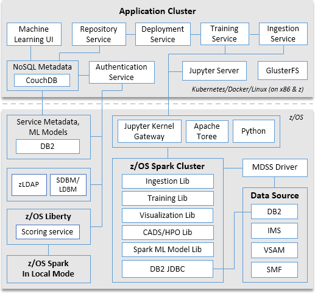
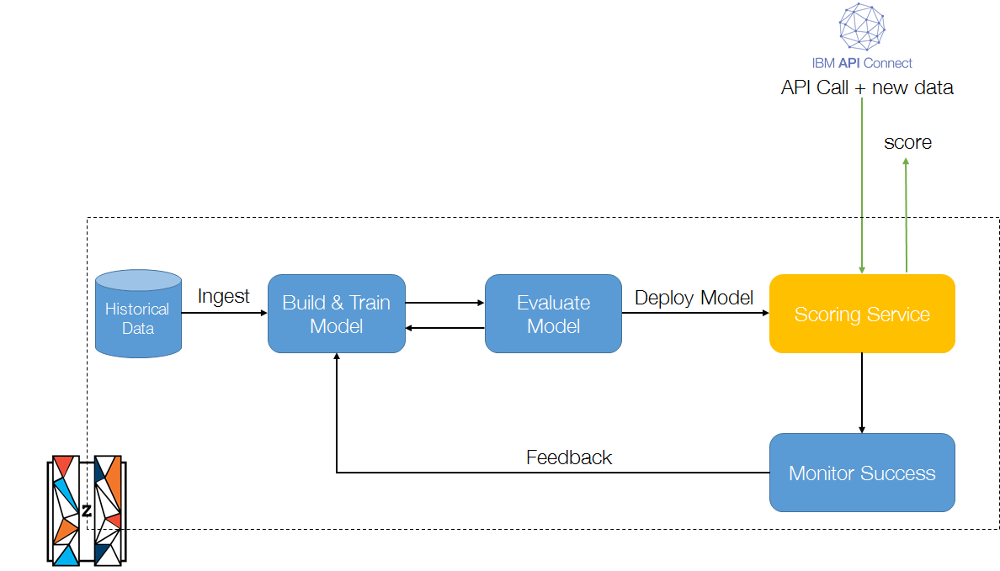

# Financial risk management using Machine Learning on zSystems

The following documentation will introduce the available Financial Risk Management API published on [IBM Bluemix] with Machine Learning running on the [IBM z Systems Mainframe] through a simulated retail bank called MPLbank ([IBM Client Center Montpellier]) for the IBM Developer Journey Program.

Please read this full page the first time to understand objectives, available APIs and the infrastructure used.

To have more details details about MPLbank, please go to [Banking Digitalization using Hybrid Cloud with z Systems].

# Overview of Machine Learning for z/OS

[IBM Machine Learning for z/OS] is an end-to-end enterprise machine learning platform that helps you create, train, and deploy machine learning models to extract value from your mission critical data on IBM z Systems, while keeping the data where it resides. Please watch [this video] to understand how IBM Machine Learning for z/OS helps Industries to resolve data value.

Machine Learning for z/OS integrates some powerful IBM machine learning capabilities, including [IBM z/OS Platform for Apache Spark]. It simplifies and automates the machine learning workflow and enables collaboration on machine learning projects across disciplines, including data scientists, data engineers, business analysts, and application developers. By keeping the data on your z Systems, Machine Learning for z/OS helps significantly reduce the cost, security risk, and time to create, evaluate, and deploy machine learning models.

As shown in the following figure, the z/OS Platform for Apache Spark cluster runs on z/OS and continuously ingests data into the Machine Learning for z/OS pipeline in real time. The application cluster runs on Linux or Linux on z Systems (Linux on z) and provides a web user interface for model training and management. Data scientists can use the user interface to select data sources for model building, training, and deployment. Application developers can see the list of saved models for deployment. Deployed models are used to make predictions. The models can be optimized as the data is pushed back into the machine learning workflow in a feedback loop.

In summary, Machine Learning for z/OS provides the following functionality to help you maximize the value from your enterprise data:

* Ingestion of data from different sources, including DB2, IMS, VSAM, and System Management Facilities (SMF).
* Transformation and cleansing of data to be used as the algorithm input
* Training of a model for the selected algorithm with the prepared data
* Evaluation, deployment, and management of the trained model
* Integration of the MLeap engine for fast online scoring
* Import and deployment of Predictive Model Markup Language (PMML) models
* A RESTful API for an application to embed the predictions that are made by the model
* Monitoring of the status, accuracy, and resource consumption of the model
* Automated feedback loop to feed new data for re-training of the model if the accuracy deteriorates
* An integrated notebook interface for data scientists to use Machine Learning APIs for interactive processing
* A web administration dashboard for managing Jupyter kernels and Kubernetes services, nodes, and pods
* Security control through integration of authentication and authorization on z Systems

for more information, go to the [IBM Machine Learning for z/OS Knowledge Center].

# Financial risk management API in MPLbank

The IBM MPLbank team made a Financial risk management API illustrating an online decision for loans approval based on Machine Learning for z/OS. The initial predictive model was designed to deliver a score representing the probability of the capacity of loan refund for a banking customer according to his personal data. From a software Architecture point of view, IBM Machine Learning for z/OS has been set up in MPLbank on Mainframe. In Consequence, the previous schema has been implemented ans act as Financial Risk Management System.

Following the next schema, a Predictive model was build from data using IBM Machine learning tools. Banking customer data was selected (his diploma, his age, his number of credit card, his income  and his number of car loans) to predict a score (probability for capacity of loan refunding) and an action (next customer's behaviour). Then it was trained with 80% of historical data and was evaluated with 20% of historical data. In this way, It ensures that the model is able to learn from fresh data.

Once the model has been approved, it has been deployed in order to act as a scoring service. On top of this service, an API was created and published to the API developer Portal. In other words, this scoring service is callable trough API. This API is available in the banking product from the [IBM Developer Portal] under the API path **/customers/loan/** .

Feel free to use this API in order to make the best innovative application for this developer Journey. Keep in mind that this API is included in a set of banking APIs. The general banking APIs documentation is available in the [Banking Digitalization using Hybrid Cloud with z Systems].

[IBM Bluemix]: https://www.ibm.com/us-en/marketplace/cloud-platform
[IBM z Systems Mainframe]: https://www-03.ibm.com/systems/z/
[IBM Client Center Montpellier]: https://www.ibm.com/ibm/clientcenter/montpellier/
[Banking Digitalization using Hybrid Cloud with z Systems]:https://github.com/IBM/Banking-digitalization-using-hybrid-cloud-with-zSystem

[IBM Machine Learning for z/OS]: https://www.ibm.com/ms-en/marketplace/machine-learning-for-zos
[IBM Machine Learning for z/OS Knowledge Center]: https://www.ibm.com/support/knowledgecenter/en/SS9PF4

[this video]:https://www.youtube.com/watch?v=Xs-4sRZ133I

[IBM Developer Portal]: https://developer-contest-spbodieusibmcom-prod.developer.us.apiconnect.ibmcloud.com/

[IBM z/OS Platform for Apache Spark]: https://www.ibm.com/us-en/marketplace/real-time-analysis-on-z-systems